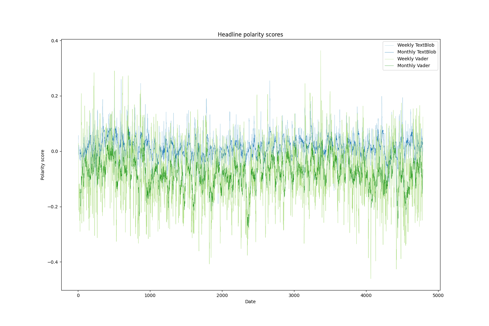

## Sentiment and rolling means
### Assignment 3

This script calculates the sentiment score for every headline in a dataset of over a million headlines taken from the Australian news source ABC. It additionally tests two rule and dictionary-based sentiment tools, SpaCyTextBlob and Vader. It saves a plot of sentiment over time with a 1-week rolling average and a plot of sentiment over time with a 1-month rolling average for the two sentiment approaches, respectively.

## Data:
As mentioned, the data comes from ABC News and is included in the repository, meaning nothing needs to be downloaded.
### SpaCy
To run the script, you will need to download Spacy and the small web model. Please type the following in the terminal:

```
source lang101_marie/bin/activate
python -m spacy download en_core_web_sm
```

## Commandline arguments:

- "--path", "-p", default = "../../data/1/abc_data/abcnews-date-text.csv"
    
- "--rolling_means", "-r", default = "7 30"
    
- "--outpath", "-o", default =../../out/1

- "--sample", "-s", default = 10000

To run the script please go to the terminal and type:

```
cd src/1

python3 sentiment.py

```

## Methods: 
To calculate and plot polarity, a class containing two main functions is defined. It is initialized with a init file which assigns arguments to a self object and loads data from the specified path. If one wish to perform the sentiment analysis on a smaller sample, the script samples 10000 random rows from the dataset. It also applies the necessary preprocessing to the data which is to transform the dates to a datetime type with a year-month-date format. Afterwards, the function that calculates headline polarity is defined. Within this function, spaCy and spacy_text_blob is initialized by importing 'en_web_sm' into a nlp object and adding spacy_text_blob to the nlp pipeline of the object. Vader is used in a similar way, where SentimentIntensityAnalyzer() is downloaded from the nltk module. From its sentiment analysis, we extract the "compound measure", a measure corresponding to the intensity or polarity of a text. The two lists of polarities are applied to the headlines. At this point, a rolling mean of 7 and 30 is made by grouping together polarity by dates and summarizing these with the respective means. Both of the summarized polarity datasets are then plotted.

## Results: 
All results can be found in the folder out/1. Below is an attachment of the plot with a rolling mean of 7 and 30:

<p align="left">
    
  </p>

Though the plots use the same data of polarity the way they are averaged make a difference. In the plot with a rolling mean of seven days, more shifts are seen and local changes in polarity are detected. The monthly rolling mean is more steadily increasing and does not have large fluctuations. Therefore, if more nuanced shifts is the point of interest, one should decrease the rolling mean. With regards to the two rule or dictionary-based methods, SpacyTextBlob and Vader, we can highlight different points. Both follow the same pattern mentioned above, but in general, Vader polarity means are lower than SpacyTextblob. On the other hand, it has larger fluctuations. Further work should include a test of other approaches such as deep
learning-based tools like BERT, though this would require annotated data (Kim & Klinger, 2018).

## References:

Kim, E., & Klinger, R. (2018). A survey on sentiment and emotion analysis for computational literary studies. arXiv preprint arXiv:1808.03137.