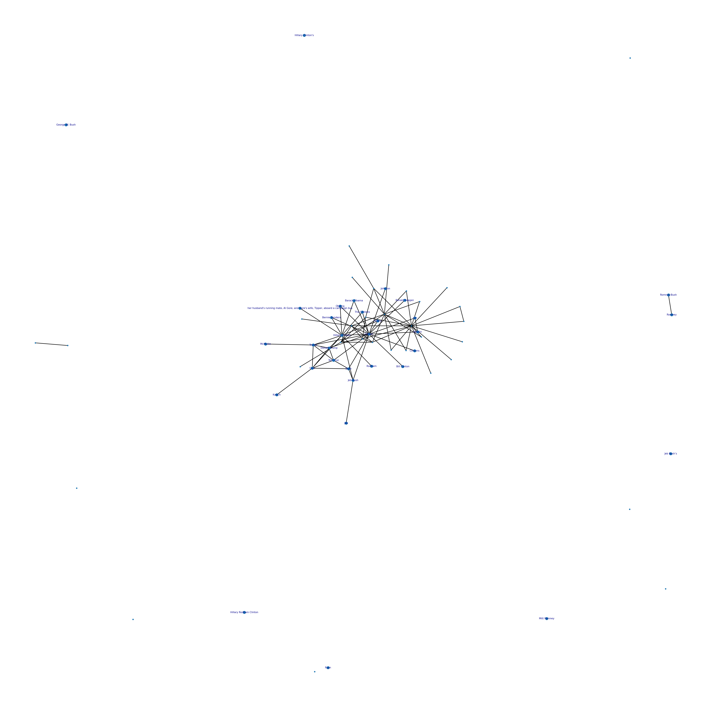

## Assignment description: 
### Assignment 4
Creating reusable network analysis pipeline
This assignment attempts to create a network pipeline as a reusable command-line tool. This command-line tool will take a given dataset and perform simple network analysis. In particular, it will build networks based on entities appearing together in the same documents to see what interactions appear and uses neuralcoref to avoid duplicates of entities. It builds upon work done in class which is found here [https://github.com/CDS-AU-DK/cds-language/blob/main/notebooks/session6.ipynb]. 

## Data:

### Edgelist
The original data used in this assignment is a collection of articles labelled as real or fake news. From this data, we filtered real news. Using ```SpaCy```, I extracted the named entities corresponding to "Persons", and with ```neuralcoref```, It was possible to summarize the co-reference of the persons (e.g. so that "Hillary Clinton" and "Hillary" would both result as "Hillary Clinton"). With this information, we created a weighted edgelist containing persons mentioned in the articles and the count of their occurrence. This weighted edgelist can be found in ```data/2```.

### Spacy and neuralcoref

If you wish to run the script that extracts persons, detects their co-reference, and creates a weighted edgelist,  you will need a couple of additional steps. Firstly, to download Spacy and the small web model, please type the following in the terminal:

```
source lang101_marie/bin/activate
python -m spacy download en_core_web_sm
```

You also need the neuralcoref source package and can download it by typing: 
```
source lang101_marie/bin/activate
git clone https://github.com/huggingface/neuralcoref.git
cd neuralcoref
pip install -r requirements.txt
pip install -e.

```

## Commandline tools:

- "-e","--edgelist_name",
  required=False, 
  type = str, 
  default = os.path.join("data", "edgelist.csv")
  help = "str of edgelist filename"
    
- "-w","--weight_treshold", 
   required=False, 
   type = int, 
   default = 500, 
   help = "int of threshold weights")
    
- "-o","--outpath", 
   required=False,
   type = str, 
   default = os.path.join("out")
   help = "str of output path"

Run the scripts by typing:

```
cd src/2 # Change directory

python3 creating_edgelist.py # Script for creating edgelist

python3 network.py # Script for creating network

```

N.B Calulating edgelist takes approximately 2 hours

## Preprocessing:

### Network:
To develop the network, a class was initiated containing various functions. Firstly, the weighted edgelist is loaded into the script using the path specified from the commandline. Afterwards, the network is filtered using only nodes containing weights above the defined threshold. Using NetworkX, this edgelist is converted to a network object. To plot the network, NetworkX is also used, using spring layout as representation of the network. Lastly, eigenvector centrality and betweenness centrality is calculated. Eigenvector centrality provides information on how well-connected a node is with other highly connected nodes and betweenness centrality is a measure telling us how central a node is between other nodes, i.e whether it is a node lying in between communication paths. These metrics are saved in the output path specified from the commandline.

## Results:

All results can be found in ```out/2```.
Below is a figure of the resulting network that was created in the script:

<p align="left">
  <a href="https://github.com/marmor97/cds-language-exam">
    
  </a>

We see that there has successfully built a network and a dataframe of eigenvector and betweenness values. An immediate impression that the network gives is that Hillary Clinton seems to be a highly occuring and connected entity whereas those she is connected to are not necessarily connected to each other. Looking at the centrality measures confirms this impression as we see that "Clinton" has an eigenvector of 0.54 and a betweenness of 0.73. However, what should also be highlighted is that the entity Clinton occurs in multiple entities (e.g. as Hillary, Hillary Clinton and Clintons) although it should probably be the same. This has probably affected the network and centrality measures.  

       
