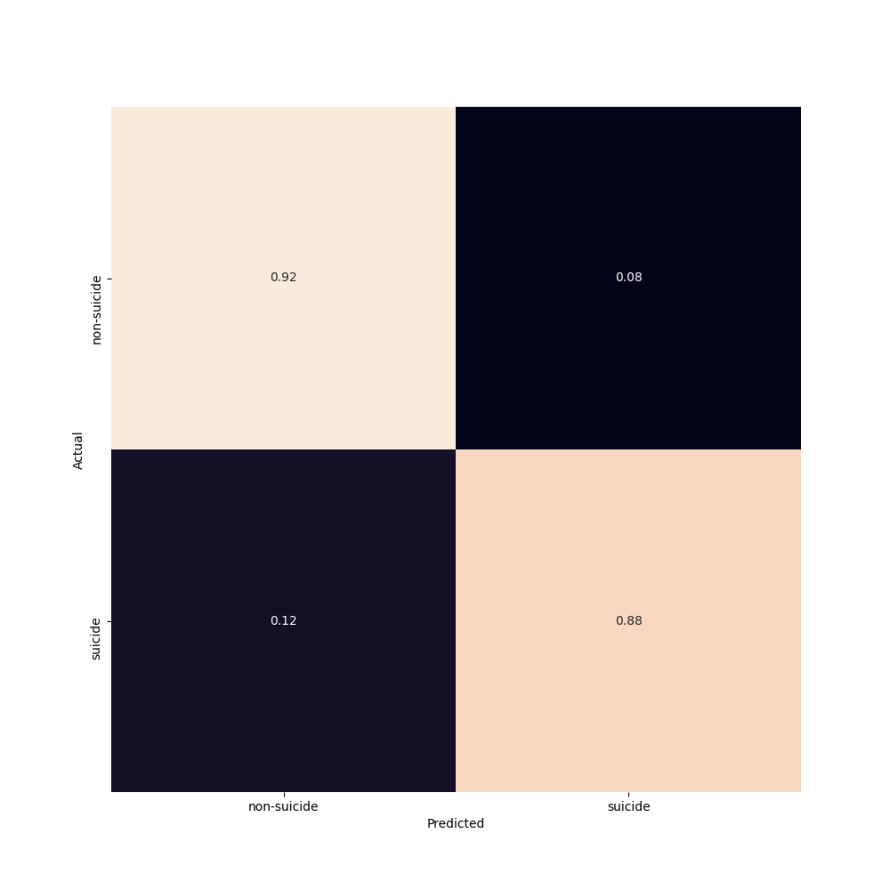

## Detecting depressed and suicidal subreddits
### Assignment 5

This assignment attempts to train a logistic regression that can distinguish between subreddits from a thread with depressed users and one with suicidal users based on the content of the sub-reddit. I believe these predictions are interesting as the two conditions are probably similar on some domains (such as the sentiment) but my hypothesis is also that suicidal posts contain more extreme expressions.  If a good classifier that can detect depressed and suicidal texts is built, it can be a useful tool in detecting and helping users and persons struggling with such battles.   

## Data

Before you can access the data, you will need to create a kaggle API following the instructions here https://github.com/Kaggle/kaggle-api#:~:text=To%20use%20the%20Kaggle%20API,file%20containing%20your%20API%20credentials. When you have created an API and have a kaggle.json file, upload the file to worker02 if you are working there and move to the place the .json file is saved. When you are there you can execute the commands below:

```
mkdir ~/.kaggle/ # New folder 
mv kaggle.json ~/.kaggle/ # Move kaggle.json to this folder - required to activate api
```
Now you can download the data directly from your terminal by moving to the folder containing my repository and download the data by typing:

```
# When you are at the 'start' of my repository (i.e. cds-language-exam) you can type

cd data # Changing directory 

mkdir 3

cd 3

kaggle datasets download -d  nikhileswarkomati/suicide-watch # Download data

unzip suicide-watch.zip # Unzip data
```
N.B.: If you do not download the data at this location, please change the input path in the commandline argument so that the script knows where to find the input data.
N.B.: The user who uploaded the suicide-watch data set has within the last days modified the dataset. Now, labels are "non-suicide" and "suicide". It does not seem like the depression part has been removed but it is not completely clear and I have been unable to reach the user. Therefore, I will treat the analysis as it is suicide and depression reddits. 

## Run script
### Commandline arguments
```
- "-f","--filename", required=False, type=str, default= "../../../data/3/Suicide_Detection.csv", help="str, filename for dataset name and location"

- "-c", "--condition", required=False, choices = ["gridsearch", "automatic"], type=str, default= "gridsearch", help="str, gridsearch to find parameters or not"   

- "-o", "--outpath", required=False, type=str,  default= "../../../out/3/", help="str, filename for dataset name and location"
```
Run the models with and without gridsearch by typing:

```
cd src/3
python3 log_reddit.py # With gridsearch

python3 log_reddit.py --condition 'automatic' # Without gridsearch
```

## Preprocessing

After the data is loaded, every row containing NA's are removed. Afterwards, the data is balanced so that the data consists of an equal amount of labels. Then, the data is vectorized and turned into an matrix of term frequency-inverse document frequency (tf-idf). The script includes a 10-fold cross-validated gridsearch of parameters on the train data, where three penalties ('none', 'L1', 'L2'), regularization strengths (1.0, 0.1, 0.01) and four solvers ('liblinear', 'sag', 'saga', 'lbfgs') are tested against the default parameters. Afterwards, the model is fit to data with a 10-fold cross-validation using cross_validate(). An F1 score is extracted from these results and saved along with a confusion matrix. To retrieve top informative features, the model is also fit with a regular 80%/20% train/test-split. 


## Results 

I wanted to study if it was possible to predict suicidal and depressed Reddit users from text. The models I trained with default and tuned hyperparameters both had a mean f1 score of 90% (std=0.3 and 0.5), indicating that it is possible to detect both suicidal and depression sub-reddits exclusively from their content.

When contrasting the two models with default hyper parameters and grid search parameters we see that there is a very small and inconsiderable difference between them. Both have very high performance, and looking at their confusion matrices also indicate that their classification is rather similar. It seems like it is misclassifying slightly more suicide reddits as depression/non-suicide reddits than the opposite. 

Figure 1. Confusion matrix from model with gridsearch parameters (upper) and with default hyperparameters (lower).

<p align="left">
    
  <p>

<p align="right">
    
  <p>

Looking at informative features, which are printed in the terminal, a couple of results need attention. We see that of most informative words are "suicide" and "depressed", respectively. It is not surprising as these are very direct indicators and one could wonder how good a classification would perform if these are not included in the corpus. Further work should include this test. Otherwise, elements seem more negative in the suicide indicative features with words such as "pain", "death" and "end" compared to features as "sleep", "college" and "friends". Note that the features are not calculated on the cross-validated model. Future development of the model should also find a way to see the informative cross-validated features. One could for example choose features that appear in > 0.5 x number of folds.


